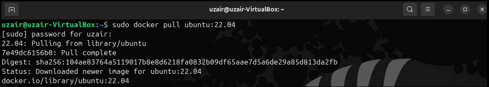
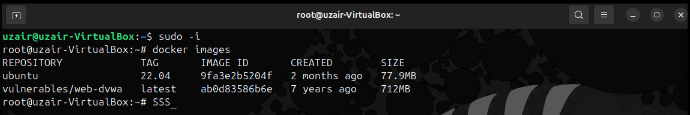
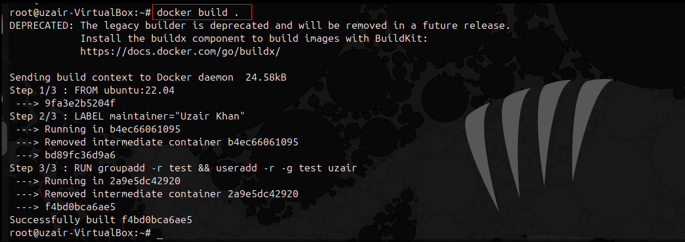
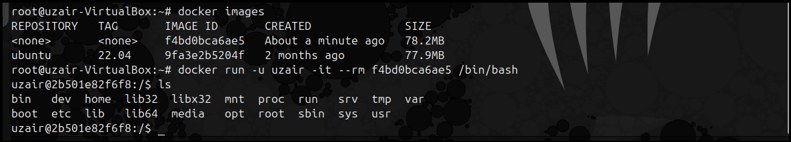

# Docker-Container-Hardening-Baseline
I implemented the container security hardening baseline, focused on reducing the impact of container compromise through _**least privilege, runtime isolation, and defensive security controls**_.

# Scope and Assumptions

## What this applies to

- Standalone Docker workloads
- Single-host or small multi-host Docker environments
- Internet-facing or untrusted applications

## What this does not cover

- Kubernetes environments (handled through PodSecurity, SecurityContext, etc.)
- Host operating system hardening (assumed to be done separately)

# Security goals

- **Prevent container-to-host escape**
- **Prevent privilege escalation inside the container**
- **Limit lateral movement between containers**
- **Reduce attacker persistence after exploitation**

# Minimal Base Images
Use minimal, well-maintained base images:
- ubuntu 
- distroless
- alpine (with caution)

**I have choose ubuntu as my base image**
***

  

***

  

***

# Container Security 
# Image Build-Time Hardening ([View Dockerfile](https://github.com/uAckerman/Docker-Container-Hardening-Baseline/blob/main/Dockerfile))

## Non-Root Execution
- **All containers must run as a non-root user which will prevent privilege escalation via kernel or Docker runtime misconfigurations.**

> RUN groupadd -r appuser && useradd -r -g appuser appuser

- **Build the image and run the build image with new user to check the access.**

***

  

***

  

***

🚧 _**Work in Progress**_
